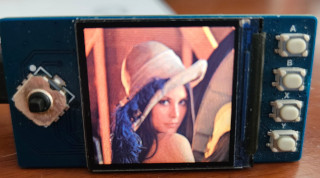

# pico-gaming-LCD
Python sprite games on a pi pico and LCD - low memory!

- bmp2screen.py - load a bmp direct to screen
- loadbmp.py - load a bmp into a spritebuffer (spritesheet)
- filebrowser.py - browse images and files, run python scripts
     
- jetpac.py - zx spectrum game
  

