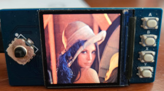

# pico-gaming-LCD
Python sprite games on a pi pico and LCD - low memory!

- bmp2screen.py - load a bmp direct to screen
- loadbmp.py - load a bmp into a spritebuffer (spritesheet)
  
- loading BMP spritesheet into offscreen framebuffer
- making small sprites and blitting from spritesheet 

